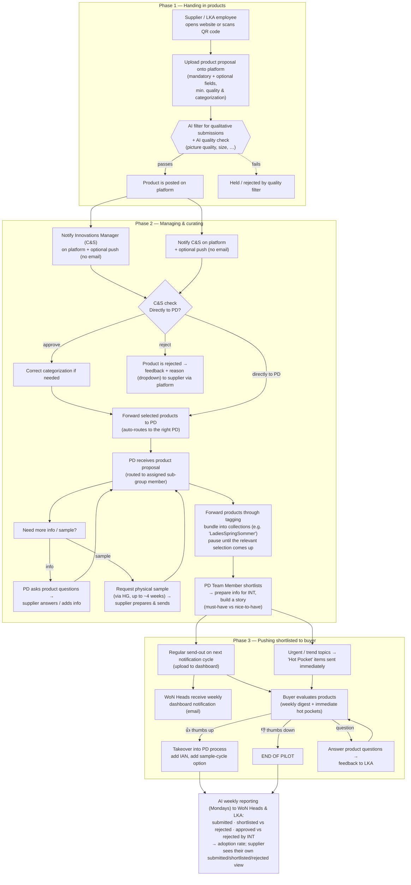

# Scouting Platform — End-to-End Process

> Assimilated from the *Scouting Process* workflow boards
> (**Workflow 3 — "Product Proposal by Supplier"** and
> **Workflow 4 — "Product Proposal by LKA"**). This is the business process the
> Product Ideas / scouting feature implements: getting a new product from a
> proposal into a buyer's hands as a ranked, decision-ready submission.

The two boards describe the **same pipeline** seen from two entry points:

| Board | Title | Who hands the product in |
|-------|-------|--------------------------|
| Workflow 3 | Product Proposal **by Supplier** | An external **supplier** uploads a proposal |
| Workflow 4 | Product Proposal **by LKA** | An internal **LKA employee** uploads a find — plus a variant where **PD requests offers** from suppliers |

Both run across the same seven swim-lanes and the same three phases.

---

## Roles (swim-lanes)

| Lane | Role | Core responsibility |
|------|------|---------------------|
| **AI / Automations** | Platform automation | Quality-filter submissions, fire notifications, generate weekly reporting & adoption-rate analytics |
| **Supplier** | External vendor | Submit product proposals; answer questions; send physical samples |
| **C&S** | Curation & Sourcing review | First human gate — check quality, fix categorization, reject with feedback or forward to PD |
| **PD** | Product Development (Manager + Team Member) | Gather all info needed for buyer send-out, curate/bundle, shortlist, build the story |
| **WoN Heads** | LKA WoN Heads | Stay informed via the weekly dashboard |
| **Buyer** | Buyer | Evaluate shortlisted products — thumbs up / down / question |
| **LKA Employee** | Internal scout | Submit products spotted in the field (store checks, market shopping, trends) |

---

## The three phases

1. **Handing in products** — proposals enter the platform and pass an automated quality filter.
2. **Managing & curating new products** — C&S and PD review, enrich, bundle and shortlist.
3. **Pushing shortlisted products to the buyer** — buyers evaluate; decisions feed back and into reporting.

---

## End-to-end flow

---

## Phase 1 — Handing in products

**Entry point.** A supplier (Workflow 3) or an LKA employee (Workflow 4) **opens
the website or scans a QR code** and **uploads a product proposal** onto the
platform.

**Submission fields**
- **Mandatory:** *What is new* (drop-down) · *Is it produced for someone else?*
- **Optional:** *to be defined (tbd).*
- **Minimum quality requirements** for the upload — number of pictures, picture
  quality, quality of information.
- **Minimum categorization level** must be filled in; deeper hierarchy optional
  *(exact level tbd).*

**LKA-employee specifics (Workflow 4):** store checks for designs and prints,
note **where the product was seen** (market, shopping, etc.), and route trends
straight to buyers into design briefings.

**Automated gate.** An **AI filter for qualitative submissions** (plus an **AI
quality check** added in Workflow 4) screens each submission against defined
filters — e.g. picture quality and size — before it is **posted on the
platform**.

**On posting, the platform notifies:**
- the **Innovations Manager (C&S)** — on-platform + optional phone push, *no email*;
- **C&S** — on-platform + optional phone push, *no email*.

---

## Phase 2 — Managing & curating new products

**C&S check (first human gate).**
- Verify the submission and **correct categorization** if needed.
- **Reject** → send feedback to the supplier with a **reason (drop-down)** via
  the platform. The supplier receives a mail notification *and* a dashboard
  entry explaining **what was rejected and why**.
- **Approve / forward** → forward selected products to **PD**, auto-routing to
  the correct PD sub-group. Open question on the board: *should some products go
  **directly to PD**, skipping C&S?*

**PD intake & enrichment.**
- The relevant **PD team member** (owner of the product's sub-group) is notified
  via **dashboard + email**. *Role: PD Manager — Task: gather all information
  needed for the buyer send-out.*
- PD reviews the proposal and, where needed, **requests more information** or a
  **physical sample**:
  - *Info loop:* PD asks product questions → supplier answers / adds additional
    information to the product.
  - *Sample loop:* request a **physical sample** (handled via **HG** — can take
    **up to ~4 weeks**, depending on sample availability and urgency) → supplier
    **prepares and sends** the sample → PD receives it.

**Curation & bundling.**
- **Forward products through tagging** — bundle products into a **collection**
  using tags (e.g. *"LadiesSpringSommer"*).
- Check with **HG**; if working with a platform, **pause until the relevant
  selection comes up**, then send out via an internal reminder or an **automatic
  send-out on a specific date** to the buyer.

**Shortlisting.**
- *Role: PD Team Member — Task: shortlist products.*
- For each shortlisted product, **prepare the information for INT and build a
  story** — define **must-have vs nice-to-have** (referencing the Ideen-App
  where relevant).

**Supplier-offer variant (Workflow 4 only).** PD can **request product offers
from suppliers**: the relevant suppliers (by product sub-group) receive a mail
notification and dashboard request to **submit a product offer**; PD then
receives those submissions, which can be **directly shortlisted**.

---

## Phase 3 — Pushing shortlisted products to the buyer

**Send-out cadence.**
- **Regular send-out** on the next notification cycle (*cycle tbd with INT*),
  uploaded to the dashboard.
- **Urgent / trend topics** are sent **directly to the buyer** as **"Hot Pocket"
  items**, delivered immediately via email + push to dashboard.

**WoN Heads** receive a **weekly dashboard notification (email)** — *Role: LKA
WoN Heads, Task: being informed.*

**Buyer evaluation.** *Role: Buyer — Task: evaluate products.* The buyer
receives Hot-Pocket items immediately and a weekly dashboard digest, then acts:

| Decision | What happens next |
|----------|-------------------|
| 👍 **Thumbs up** | **Takeover into the PD process** — add the **IAN** (item number) for the product into the platform; add a **sample-cycle option** if a sample is already available in **SGP / HK** *(marked out of scope for the pilot in Workflow 4)* |
| 👎 **Thumbs down** | **END OF PILOT** for that product |
| ❓ **Question** | Buyer's product questions are answered and **fed back to LKA** |

---

## Reporting & analytics (AI / Automations)

A **weekly dashboard** is sent by **email every Monday** to **WoN Heads and
LKA**, covering:

- products **submitted by supplier**;
- **shortlisted vs rejected by LKA**;
- **rejected vs approved by INT** (overall and per supplier);
- how submitted products map to **adoption by INT** → an **adoption rate**.

Suppliers get their **own platform view**: an overview of their **submitted,
shortlisted and rejected** products.

---

## Decision points

- **AI quality gate** — does the submission meet picture/info quality? (auto)
- **C&S: directly to PD?** — route through C&S review or straight to PD.
- **C&S: approve or reject** — forward to PD, or reject with a reason.
- **PD: more info / sample needed?** — trigger the info loop and/or sample loop.
- **PD: bundle now or pause** — hold a product until its collection's selection window.
- **Send-out: regular cycle vs urgent Hot Pocket.**
- **Buyer: thumbs up / thumbs down / question.**

---

## Notifications matrix

| Event | Recipient | Channel |
|-------|-----------|---------|
| Product posted | Innovations Manager (C&S) | Platform + optional push (no email) |
| Product posted | C&S | Platform + optional push (no email) |
| Forwarded to PD | Assigned PD team member | Dashboard + email |
| Rejected by C&S | Supplier | Platform mail + dashboard (reason) |
| Info / sample needed | Supplier | Platform mail + dashboard |
| Offer requested (WF4) | Suppliers (by sub-group) | Mail + dashboard |
| Shortlisted / send-out | Buyer | Weekly dashboard email; Hot Pockets immediately (email + push) |
| Weekly digest | WoN Heads & LKA | Dashboard email (Mondays) |

---

## Open questions / TBDs flagged on the boards

These are unresolved items the boards call out (most owned by **Maerthe**):

- **Define the needed product information** — description, material composition,
  size, functions, pictures, price? *(@Fei Yuan & @ruth to define; @Maerthe to
  check necessary product info with INT.)*
- **Minimum categorization level** and how deep the hierarchy must go *(tbd).*
- **Optional submission fields** — *tbd.*
- **Should some products go directly to PD**, bypassing C&S?
- **Define the C&S check person** *(Maerthe with Sarah).*
- **Notification cycle** for send-out — *tbd with INT.*
- **Is notification frequency individualizable?** (weekly / monthly / every change)
- **Who receives and evaluates for INT?** Same person? How?
- **How should information reach purchasing (EK)?** *("Wie sollen Informationen
  zu EK gelangen?")*
- **Adding the IAN** for a product into the platform — mechanism tbd.
- **Sample-cycle option** when a sample already exists in **SGP / HK** *(out of
  scope for the pilot per Workflow 4).*

---

## Glossary

| Term | Meaning (as used on the boards) |
|------|---------------------------------|
| **PD** | Product Development (PD Manager, PD Team Member) |
| **C&S** | Curation & Sourcing review team (home of the Innovations Manager) |
| **INT** | Internal merchandising/buying function that products are evaluated and adopted against |
| **LKA** | Internal organisation submitting/owning the scouting pilot (LKA employees, LKA WoN Heads) |
| **WoN Heads** | Heads kept informed via the weekly dashboard |
| **HG** | Sourcing agent/office that handles physical samples (sample turnaround up to ~4 weeks) |
| **SGP / HK** | Singapore / Hong Kong sourcing offices where samples may already exist |
| **IAN** | Internal article/item number assigned on buyer takeover |
| **EK** | *Einkauf* — purchasing |
| **Hot Pocket** | Urgent / trending item fast-tracked straight to the buyer |
| **Ideen-App** | Internal idea app referenced when building the product story |

> **Note on names** — *Maerthe, Moritz, Sarah, Fei Yuan, ruth* appear on the
> boards as **owners of open questions / steps**, not as process roles.

---

## What changed between Workflow 3 and Workflow 4

- **Entry point** reframed from *supplier-submitted* to *LKA-submitted*, with the
  supplier path retained.
- Added an explicit **AI quality check** alongside the qualitative AI filter.
- Added the **PD-requests-offers-from-suppliers** loop: suppliers are asked to
  submit offers by sub-group, and those can be **directly shortlisted**.
- Marked the **SGP / HK sample-cycle option** as **out of scope for the pilot**.
